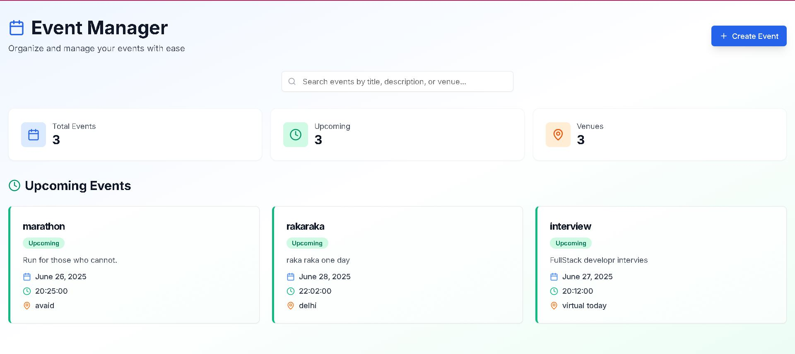
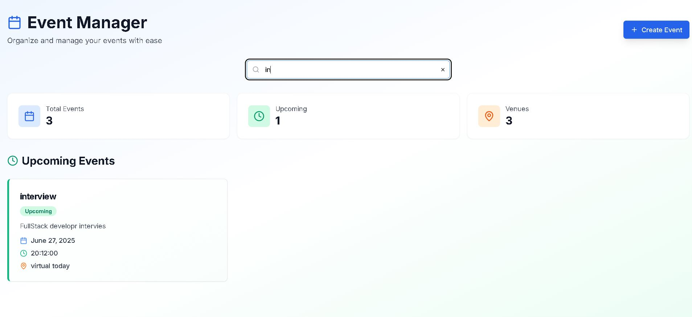

#  Event Management System with PostgreSQL

A comprehensive, production-ready event management application built with Next.js and PostgreSQL. This system demonstrates modern full-stack development practices with a beautiful, responsive interface and robust backend API.




## 🚀 Features

### Core Functionality
- **Complete CRUD Operations**: Create, read, update, and delete events
- **PostgreSQL Database**: Robust relational database with proper indexing
- **RESTful API**: Clean API endpoints following REST conventions
- **Advanced Search**: Filter events by title, description, or venue
- **Event Categorization**: Separate upcoming and past events
- **Comprehensive Validation**: Server-side and client-side validation

### User Experience
- **Responsive Design**: Optimized for mobile, tablet, and desktop
- **Professional UI**: Modern card-based layout with hover effects
- **Intuitive Navigation**: Easy-to-use interface with clear visual hierarchy
- **Real-time Feedback**: Toast notifications for all user actions
- **Loading States**: Smooth loading animations and skeleton screens

### Technical Features
- **TypeScript**: Full type safety throughout the application
- **Next.js API Routes**: Server-side API endpoints
- **PostgreSQL Integration**: Direct database connection with connection pooling
- **Error Handling**: Comprehensive error management
- **UUID Primary Keys**: Secure, non-sequential identifiers

## 🛠 Technology Stack

- **Frontend**: Next.js 13 with App Router
- **Backend**: Next.js API Routes + Django REST Framework
- **Database**: PostgreSQL (direct connection)
- **Database Drivers**: Native PostgreSQL driver (pg) for Next.js, psycopg2 for Django
- **Styling**: Tailwind CSS with shadcn/ui components
- **TypeScript**: Full type safety on frontend
- **Python**: Django backend API
- **Icons**: Lucide React
- **Date Handling**: date-fns
- **Notifications**: Sonner

## 📋 Setup Instructions

### Prerequisites
- Node.js 18+ installed
- Python 3.8+ installed
- PostgreSQL 12+ installed and running
- Database management tool (pgAdmin, DBeaver, or psql)

### 1. Database Setup

#### Automated Setup

For Windows users, you can use the provided setup scripts to automatically configure PostgreSQL:

```bash
# Using PowerShell script
.\setup_postgresql.ps1

# OR using batch file
.\setup_postgresql.bat
```

These scripts will:
- Check if PostgreSQL is installed and running
- Create the `event_management` database if it doesn't exist
- Apply the database schema and migrations from `postgresql/migrations`

#### Manual Setup

Alternatively, you can set up the database manually:

```sql
CREATE DATABASE event_management;
```

Then run the schema script located in `postgresql/migrations/20250623163931_yellow_scene.sql`:

```bash
psql -U postgres -d event_management -f postgresql/migrations/20250623163931_yellow_scene.sql
```

Or copy and paste the SQL commands into your database management tool.

### 2. Environment Configuration

#### Frontend (.env.local)

Create or update the `.env.local` file in the project root with your PostgreSQL credentials:

```env
# PostgreSQL Database Configuration
DB_HOST=localhost
DB_PORT=5432
DB_NAME=event_management
DB_USER=your_postgres_username
DB_PASSWORD=your_postgres_password

# Next.js Configuration
NEXTAUTH_SECRET=your-secret-key-here
NEXTAUTH_URL=http://localhost:3000
```

#### Backend (.env)

Create or update the `.env` file in the `backend` directory with your PostgreSQL credentials:

```env
# PostgreSQL Database Configuration
DB_NAME=event_management
DB_USER=your_postgres_username
DB_PASSWORD=your_postgres_password
DB_HOST=localhost
DB_PORT=5432

# Django Configuration
DJANGO_SECRET_KEY=your-django-secret-key-here
DJANGO_DEBUG=True
```

### 3. Installation & Development

#### Frontend (Next.js)

```bash
# Install dependencies
npm install

# Start development server
npm run dev
```

The frontend application will be available at `http://localhost:3000`

#### Backend (Django)

```bash
# Navigate to backend directory
cd backend

# Create and activate virtual environment (Windows)
python -m venv venv
.\venv\Scripts\activate

# Install dependencies
pip install -r requirements.txt

# Run migrations
python manage.py migrate

# Start development server
python manage.py runserver
```

The Django API will be available at `http://localhost:8000/api/events/`

## 🔌 API Endpoints

### Next.js Frontend API

| Method | Endpoint | Description |
|--------|----------|-------------|
| GET | `/api/events` | Get all events |
| POST | `/api/events` | Create a new event |
| GET | `/api/events/[id]` | Get a specific event |
| PUT | `/api/events/[id]` | Update an event |
| DELETE | `/api/events/[id]` | Delete an event |

### Django Backend API

| Method | Endpoint | Description |
|--------|----------|-------------|
| GET | `http://localhost:8000/api/events/` | Get all events |
| POST | `http://localhost:8000/api/events/` | Create a new event |
| GET | `http://localhost:8000/api/events/<id>/` | Get a specific event |
| PUT | `http://localhost:8000/api/events/<id>/` | Update an event |
| DELETE | `http://localhost:8000/api/events/<id>/` | Delete an event |

### API Request/Response Examples

**Create Event (POST /api/events)**
```json
{
  "title": "Tech Conference 2024",
  "description": "Annual technology conference",
  "venue": "Convention Center",
  "date": "2024-03-15",
  "time": "09:00"
}
```

**Response**
```json
{
  "id": "123e4567-e89b-12d3-a456-426614174000",
  "title": "Tech Conference 2024",
  "description": "Annual technology conference",
  "venue": "Convention Center",
  "date": "2024-03-15",
  "time": "09:00:00",
  "created_at": "2024-01-15T10:30:00.000Z",
  "updated_at": "2024-01-15T10:30:00.000Z"
}
```

## 🗄️ Database Schema

```sql
CREATE TABLE events (
    id UUID PRIMARY KEY DEFAULT gen_random_uuid(),
    title VARCHAR(255) NOT NULL,
    description TEXT NOT NULL,
    venue VARCHAR(255) NOT NULL,
    date DATE NOT NULL,
    time TIME NOT NULL,
    created_at TIMESTAMP WITH TIME ZONE DEFAULT NOW(),
    updated_at TIMESTAMP WITH TIME ZONE DEFAULT NOW()
);
```

### Indexes
- `idx_events_date`: Optimizes date-based queries
- `idx_events_title`: Improves search performance

### Triggers
- `set_updated_at`: Automatically updates the `updated_at` timestamp when a record is modified

### Migration Files
The database schema and sample data are defined in:
- `postgresql/migrations/20250623163931_yellow_scene.sql`

## 🎨 Component Architecture

### Core Components
- **`EventCard`**: Displays individual event information with actions
- **`EventForm`**: Handles event creation and editing with validation
- **`SearchBar`**: Provides real-time search functionality

## 🏗️ System Architecture

### Overview
This application follows a modern architecture with a clear separation between frontend and backend:

```
┌─────────────────┐      ┌─────────────────┐      ┌─────────────────┐
│                 │      │                 │      │                 │
│  Next.js        │──────▶  Django         │──────▶  PostgreSQL     │
│  Frontend       │      │  Backend API    │      │  Database       │
│                 │      │                 │      │                 │
└─────────────────┘      └─────────────────┘      └─────────────────┘
```

### Communication Flow
1. The Next.js frontend makes HTTP requests to its own API routes
2. The Next.js API routes forward these requests to the Django backend API
3. The Django backend processes the requests, interacts with the PostgreSQL database, and returns responses
4. The Next.js API routes return these responses to the frontend

### Benefits of This Architecture
- **Separation of Concerns**: Clear division between frontend and backend
- **Scalability**: Each component can be scaled independently
- **Technology Flexibility**: Leverage the strengths of both JavaScript/TypeScript and Python ecosystems
- **Security**: Backend API can implement additional security measures
- **Performance**: Django's ORM provides efficient database interactions

### API Layer

#### Frontend (Next.js)
- **`/app/api/events/route.ts`**: Handles GET and POST requests
- **`/app/api/events/[id]/route.ts`**: Handles GET, PUT, and DELETE for specific events
- **`/lib/db.ts`**: Database connection and configuration

#### Backend (Django)
- **`/backend/events/views.py`**: API views for handling events
- **`/backend/events/serializers.py`**: Serializers for event data
- **`/backend/events/models.py`**: Event data models
- **`/backend/events/urls.py`**: URL routing for the events API
- **`/backend/event_management/settings.py`**: Django settings including database configuration

## 🔒 Data Validation

### Client-Side Validation
- Required field validation
- Minimum length requirements
- Date validation (no past dates)
- Real-time error feedback

### Server-Side Validation
- Input sanitization
- Required field checks
- SQL injection prevention
- Error response handling

## 🚀 Deployment

### Local Development

#### Frontend
```bash
npm run dev
```

#### Backend
```bash
cd backend
.\venv\Scripts\activate
python manage.py runserver
```

### Production Build

#### Frontend
```bash
npm run build
npm start
```

#### Backend
```bash
cd backend
.\venv\Scripts\activate
python manage.py collectstatic
gunicorn event_management.wsgi:application --bind 0.0.0.0:8000
```

### Environment Variables for Production
Ensure all environment variables are properly set in your production environment:

#### Frontend
- Database connection details (if using direct DB connection)
- Security keys
- Backend API URL

#### Backend
- Database connection details
- Django secret key
- Debug mode (set to False)
- Allowed hosts
- CORS settings

## 🔧 Customization

### Adding New Fields
1. Update the database schema
2. Modify the `Event` interface in `types/event.ts`
3. Update API routes to handle new fields
4. Modify the EventForm component
5. Update EventCard display

### Styling Customization
- Modify `tailwind.config.ts` for theme changes
- Update `app/globals.css` for global styles
- Components use CSS variables for easy theming

## 📱 Responsive Design

Fully responsive with breakpoints:
- **Mobile**: < 768px
- **Tablet**: 768px - 1024px  
- **Desktop**: > 1024px

## 🛡️ Security Features

- **SQL Injection Prevention**: Parameterized queries
- **Input Validation**: Both client and server-side
- **UUID Primary Keys**: Non-sequential, secure identifiers
- **Environment Variables**: Sensitive data protection
- **Error Handling**: Secure error messages

## 🔍 Performance Optimizations

- **Database Indexing**: Optimized queries
- **Connection Pooling**: Efficient database connections
- **Client-Side Caching**: Reduced API calls
- **Lazy Loading**: Improved initial load times

## 🧪 Testing

To test the API endpoints, you can use tools like:
- **Postman**: GUI-based API testing
- **curl**: Command-line testing
- **Thunder Client**: VS Code extension

Example curl command:
```bash
curl -X POST http://localhost:3000/api/events \
  -H "Content-Type: application/json" \
  -d '{"title":"Test Event","description":"Test Description","venue":"Test Venue","date":"2024-12-25","time":"10:00"}'
```

## 🤝 Contributing

This project follows production-ready practices:
1. Follow existing code patterns
2. Maintain TypeScript coverage
3. Add proper error handling
4. Include responsive design
5. Update documentation

## 📄 License

This project is open source and available under the MIT License.
